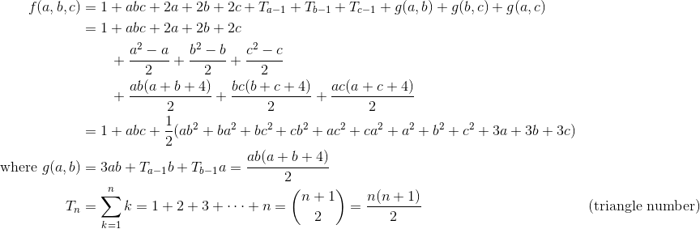
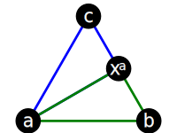
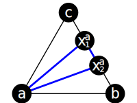
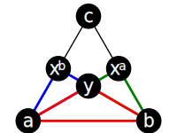
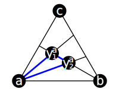

# tris

Prove that the number of triangles that can be made inside of an equilateral triangle where `a` `b` and `c` are the number of internal lines coming from the corresponding point and no 3 of those lines cross at a single point, is:

## Explanation

Formula                        | Explanation 
-------------------------------|-------------------
1                              | The base triangle
abc                            | If 3 lines can't cross at a single point, they must cross at 3 points and make a triangle   
2a + 2b + 2c                   | Each line from `a` creates a point `xᵃ` on line `A`, making triangles `abxᵃ` and `acxᵃ` 
Ta-1 + Tb-1 + Tc-1| Every pair of lines from `a` creates a triangle with a segment of line `A` as the third line 
g(a,b) + g(b,c) + g(a,c)       | Triangles created from intersections between two lines
**where** g(a,b) | =
3ab                            | Each line from `a` splits each line from `b` at point `y`, making triangles ayxb, byxa, and `ayb`. This is similar to `2a` above, but with a third triangle created using point xa. 
Ta-1b + Tb-1a | Every pair of lines from `a` creates a triangle with each line from `b`, and vice versa. This is the same as the triangles created along the edges above. 

## Observations

 - If z=0, it simplifies to 1/2(x+1)(y+1)(x+y+2)
 - If z=0 and x=y, it simplifies to (x+1)^3
 - When treated as a graph with a node at each line crossing and an edge between each pair of nodes in a line:
   - The number of edges is x\*T(y+z+1)+T(x+1)+y\*T(x+z+1)+T(y+1)+z\*T(x+y+1)+T(z+1)
     - Where T is the [Triangle Number](https://en.wikipedia.org/wiki/Triangle_number), i.e. T(n)=n*(n+1)/2
   - The number of nodes is xy + xz + yz + x + y + z + 3
     - Every x crosses every y and z, every y crosses every z, each x y and z adds a node on the opposite base line, and there are 3 starting nodes
   - If z=0, the number of triangles is edges-nodes+1
   
## Usage

`lein run` and visit `localhost:3000`

## License

To the extent possible under law, the person who associated CC0 with this work has waived all copyright and related or neighboring rights to this work.
